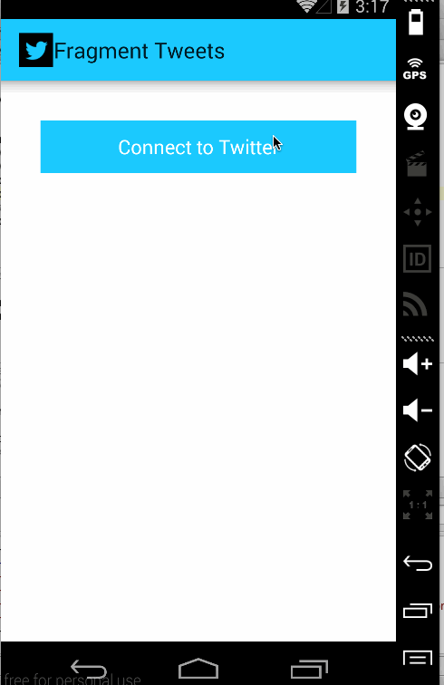

# Twitter Client

PART :2

This is an Android demo application for displaying the recent feed from Twitter. See the [Twitter with Fragments](http://courses.codepath.com/courses/intro_to_android/week/4#!assignment) for details.

Time spent: 24 hours spent in total

Completed User stories:
* [x] Required:User can switch between Timeline and Mention views using tabs.
* [x] Required:User can view their home timeline tweets.
* [x] Required:User can view the recent mentions of their username.
* [x] Required:User can navigate to view their own profile
* [x] Required:User can see picture, tagline, number of followers, number of following, and tweets on their profile.
* [x] Required:User can click on the profile image in any tweet to see another user's profile.
* [x] Required:User can see picture, tagline, number of followers, number of following, and tweets of clicked user.
* [x] Required:Profile view includes user's timeline
* [x] Required:User can infinitely paginate any of these timelines (home, mentions, user) by scrolling to the bottom

Walkthrough of all user stories:

PART :1

This is an Android demo application for displaying the recent feed from Twitter. See the [Simple Twitter Client](http://courses.codepath.com/courses/intro_to_android/week/3#!assignment) for details.

Time spent: 24 hours spent in total

Completed user stories:
  * [x] Required: User can sign in to Twitter using OAuth login.
  * [x] Required: User can view the tweets from their home timeline
  * [x] Required: User should be displayed the username, name, and body for each tweet
  * [x] Required: User should be displayed the relative timestamp for each tweet "8m", "7h"
  * [x] Required: User can view more tweets as they scroll with infinite pagination
  * [x] Optional: Links in tweets are clickable and will launch the web browser (see autolink)
  * [x] Required:User can compose a new tweet
  * [x] Required:User can click a “Compose” icon in the Action Bar on the top right
  * [x] Required:User can then enter a new tweet and post this to twitter
  * [x] Required:User is taken back to home timeline with new tweet visible in timeline
  * [x] Optional: User can see a counter with total number of characters left for tweet
  * [x] Optional: User can refresh tweets timeline by pulling down to refresh (i.e pull-to-refresh)

Walkthrough of all user stories:

GIF created with [LiceCap](http://www.cockos.com/licecap/).

